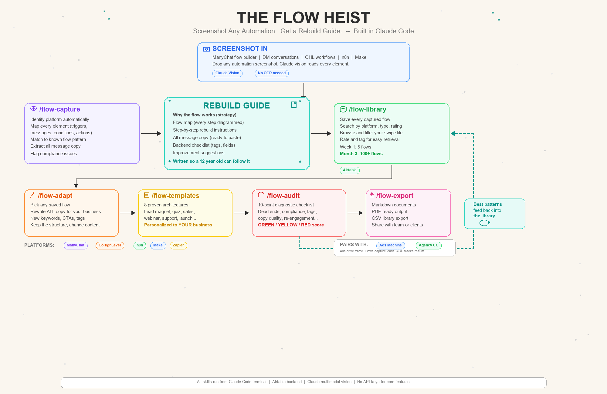

<div align="center">



# The Flow Heist

*Screenshot any automation. Get a step-by-step rebuild guide.*

[](./LICENSE)
[](https://github.com)
[](https://claude.ai/claude-code)

See a flow. Steal the pattern. Build it yourself.
**Screenshots stop being useless.**

</div>

---

## The Problem

You see a killer ManyChat flow on Twitter. Or a DM sequence that converted you into a lead in 30 seconds. Or a course showing the "perfect" automation.

You screenshot it.

Then you stare at it for 20 minutes trying to figure out how to actually build it.

**Screenshot-to-code became one of the most popular repos on GitHub** because people wanted to turn UI screenshots into working code. Nobody built the same thing for automations.

Until now.

---

## 5 Seconds. That's It.

Three ways to get a screenshot into the Flow Heist:

### Option A: Clipboard (fastest)
```
1. Screenshot the flow       (Win+Shift+S or Cmd+Shift+4)
2. Type: /flow-capture
3. Hit enter
```
The skill auto-grabs whatever image is on your clipboard. No saving files. No uploading.

### Option B: File path
```
/flow-capture path/to/screenshot.png
```

### Option C: Folder (batch)
```
/flow-batch screenshots/
```
Processes every screenshot in the folder at once.

That's it. Screenshot to rebuild guide in one command.

---

## What It Does

Drop a screenshot. Get everything you need to rebuild it.

```
YOU                              THE FLOW HEIST
─────────────────────────────────────────────────

Screenshot of a                  "This is a lead magnet flow.
ManyChat flow builder    -->     Here's why it works, here's
                                 every step to rebuild it, and
                                 here's the copy to paste in."

DM conversation you              "This is a 5-message sales
went through             -->     qualifier. The second question
                                 is doing the heavy lifting.
                                 Here's how to build your own."

GHL workflow from                "This is a client onboarding
a client's account       -->     sequence. 3 things are missing.
                                 Here's the fix + rebuild guide."
```

---

## How It Works

```
CAPTURE    Screenshot any flow (DMs, flow builder, video frame)
   |
ANALYZE    Claude reads the screenshot, identifies every element
   |
GUIDE      Strategy breakdown + step-by-step rebuild instructions
   |
LIBRARY    Save to Airtable, searchable by platform, type, rating
   |
ADAPT      Rewrite any saved flow for YOUR business
   |
AUDIT      Find leaks in your existing flows
   |
LOOP       Your library grows. Your patterns compound.
```

---

## Quick Start

### One-line install (Mac/Linux)

```bash
curl -fsSL https://raw.githubusercontent.com/seancrowe01/flow-heist/main/install.sh | bash
```

### One-line install (Windows PowerShell)

```powershell
irm https://raw.githubusercontent.com/seancrowe01/flow-heist/main/install.ps1 | iex
```

### Manual install

```bash
git clone https://github.com/seancrowe01/flow-heist.git
cd flow-heist
cp .env.example .env
```

Add your Airtable API key to `.env`, open Claude Code, and run `/flow-setup`. Done.

---

## Skills -- How to Use Each One

All commands run inside Claude Code. Type the command and hit enter.

### `/flow-setup` -- Run this first
One-time wizard. Asks about your business, creates your Airtable tables, wires your MCP servers, generates your config. Takes 5 minutes.
```
/flow-setup
```

### `/flow-capture` -- The core skill
Screenshot in, rebuild guide out. Give it a file path, or copy a screenshot and it grabs from your clipboard automatically.
```
/flow-capture                              (grabs clipboard)
/flow-capture screenshots/my-flow.png      (specific file)
```

### `/flow-adapt` -- Make it yours
Takes any flow from your library and rewrites every message for your business. Same structure, new copy.
```
/flow-adapt Lead Magnet - PDF Delivery
/flow-adapt last                           (adapts the last captured flow)
```

### `/flow-audit` -- Find the leaks
Runs a 10-point diagnostic on any flow. Works on screenshots or saved flows.
```
/flow-audit                                (paste a screenshot)
/flow-audit Lead Magnet - PDF Delivery     (audit a saved flow)
```

### `/flow-templates` -- Start from proven patterns
8 pre-built flow architectures. Pick one, answer 3 questions about your business, get a full rebuild guide with copy written for you.
```
/flow-templates
```

### `/flow-library` -- Browse your saved flows
Search and filter everything you've captured, adapted, or built.
```
/flow-library                              (show all)
/flow-library ManyChat lead magnets        (search)
```

### `/flow-batch` -- Process a folder of screenshots
Drop 10 screenshots in a folder, process them all at once.
```
/flow-batch screenshots/
```

### `/flow-export` -- Share your flows
Export any flow as a clean markdown document or CSV.
```
/flow-export Lead Magnet - PDF Delivery
/flow-export all                           (CSV of entire library)
```

---

## The DM Heist

This is the move that nobody else can do.

1. Find a creator with a killer ManyChat flow
2. Comment their keyword on a post
3. Go through their entire DM sequence
4. Screenshot every message, every button, every path
5. Run `/flow-capture` -- it grabs the screenshot and does the rest

You get back:
- **Why the flow works** -- the psychology behind the sequence
- **A complete flow map** -- every message, condition, and action diagrammed
- **Step-by-step rebuild guide** -- written so a 12 year old could follow it
- **All the copy** -- every message ready to paste into your flow builder
- **What's hidden** -- the tags, fields, and integrations you can't see in DMs
- **What to improve** -- the parts that could be better

The creator spent weeks building and testing that flow. You rebuilt the pattern in 30 seconds.

This is not copying. You're studying what works, understanding why, and building your own version for your own business with your own copy. The same way every chef studies other restaurants' menus.

---

## "Doesn't Something Like This Already Exist?"

Not really.

| What Exists Today | Limitation |
|-------------------|------------|
| **AI flow builders** (text-to-flow) | Generate flows from text descriptions. Cannot read screenshots. |
| **Screenshot-to-JSON bots** | Single platform only. Raw output, no rebuild guide, no library. |
| **Template marketplaces** | Generic templates. No customization. No strategy explanation. |
| **Flow sharing/cloning** | Requires admin access to the source account. |
| **Freelancers** | One flow at a time. No learning, no library, no compound value. |

None of them do what this does: **screenshot in, personalized rebuild guide out, saved to a growing library.**

People built screenshot-to-code for UI design and it became one of the most popular repos on GitHub. Nobody has applied that concept to automations. This space is wide open.

---

## How Accurate Is It?

Claude reads screenshots natively. No OCR. No third-party API. Just multimodal vision.

| Screenshot Type | Accuracy | Why |
|----------------|----------|-----|
| Flow builder (ManyChat, GHL) | 90%+ | Consistent UI, predictable elements, text is clear |
| DM conversations | 95%+ message content | Every message is readable; backend actions are estimated |
| n8n / Make canvases | 85%+ | Node types identified by shape and color |
| Blurry / cropped screenshots | 60-70% | Partial information, flagged as incomplete |

The system ships with `reference/manychat-anatomy.md` -- a 659-line visual dictionary of every ManyChat element. Claude reads this before analyzing your screenshot, so it knows exactly what it's looking at.

When something is unclear, it says so. Cut-off text is marked `[text cut off]`, not guessed. Hidden backend actions are listed as "Likely Backend Actions" with recommendations, not stated as fact.

---

## The Library Compounds

Your first capture takes 30 seconds. Then it starts stacking.

| Week | Library Size | What You Have |
|------|-------------|---------------|
| 1 | 5-10 flows | A few captures from Twitter and courses |
| 4 | 30-50 flows | Patterns emerging -- you know what works in your niche |
| 12 | 100+ flows | A swipe file no template marketplace can match |

The library grows three ways:

- **Capture** -- screenshot flows from social media, courses, competitors
- **Templates** -- generate from 8 proven architectures, already personalized
- **Adapt** -- take any flow and rewrite it for a different offer or audience

Every flow is searchable by platform, type, trigger, and rating. It's a personal automation swipe file that gets more valuable every week.

---

## 8 Pre-Built Templates

Don't have a screenshot to start from? Pick a template. Every message is written for YOUR business before you see it.

| Template | What It Does | Build Time |
|----------|-------------|------------|
| **Lead Magnet** | Comment > DM > collect email > deliver PDF > follow up | 10 min |
| **Quiz Funnel** | Questions > segment audience > personalized CTA | 20 min |
| **Sales Qualifier** | Qualify with 2-3 questions > booking link or content | 15 min |
| **Webinar Registration** | Register > reminder sequence > event link | 15 min |
| **Customer Support** | FAQ menu > auto-answers > escalate to human | 25 min |
| **Re-engagement** | Inactivity trigger > value message > win back | 10 min |
| **Launch Countdown** | Waitlist > countdown > urgency > sales CTA | 15 min |
| **Content Upgrade** | Story reply > deliver bonus > capture email | 10 min |

Run `/flow-templates`, pick a number, answer 3 questions about your business. Full rebuild guide with all copy written and ready to build.

---

## The Flow Doctor

Every flow leaks. Most people never find out where.

`/flow-audit` runs a 10-point diagnostic on any flow:

| Check | What It Catches | Priority |
|-------|----------------|----------|
| Dead Ends | Paths that lead nowhere | Critical |
| Delay Timing | Messages too fast or outside 24hr window | Critical |
| Fallback Handling | No response to unexpected input | Critical |
| Tag Coverage | Leads not tagged for retargeting | Critical |
| Compliance | Platform rule violations | Critical |
| Measurement | No way to track conversions | Critical |
| Segmentation | Everyone gets the same path | Important |
| Re-engagement | Abandoned users never followed up | Important |
| Button Overload | Too many options causing choice paralysis | Important |
| Copy Quality | Wall of text, weak CTAs | Important |

Output is simple:

```
Overall: YELLOW (7/10 passed)

PRIORITY FIXES:
1. [Critical] No tags at conversion points -- add "downloaded", "email-collected"
2. [Important] No re-engagement -- add 24hr follow-up for abandoned users
3. [Important] No segmentation -- add condition branch after question 2
```

Every FAIL comes with the exact fix. Not "improve your tags" -- the specific tag names, where to add them, and why.

---

## Platform Support

| Platform | What Works |
|----------|------------|
| **ManyChat** | Full support -- capture, templates, audits, adapt, everything |
| **GoHighLevel** | Screenshot capture + rebuild guides |
| **n8n** | Screenshot capture + rebuild guides |
| **Make.com** | Screenshot capture + rebuild guides |
| **Zapier** | Screenshot capture + rebuild guides |

ManyChat is the primary platform. All others work for screenshot analysis today. The system ships with visual identification guides for each platform so Claude knows the difference between a ManyChat condition block and a GHL workflow action.

---

## The 24-Hour Rule

DM automations play by different rules than email. If you don't know them, your flows get shut down.

The Flow Heist knows them. Every rebuild guide and audit flags compliance issues automatically:

- **24-hour messaging window** -- automations must fire within 24 hours of the user's last action. After that, you need a One-Time Notification or manual message.
- **Comment triggers** -- keywords must be specific. Generic words like "yes" or "love" will fire on normal comments and annoy people.
- **Private reply opt-in** -- Meta requires the user to initiate the DM. The comment-to-DM pattern handles this, but direct cold DM automations do not.
- **Platform consequences** -- temporary restriction, flow disabled, page restricted, permanent ban. In that order.

The reference file `compliance.md` covers every rule across Instagram, Messenger, and WhatsApp. When you capture a flow that breaks a rule, the rebuild guide tells you.

---

## n8n Automation (Optional)

**Weekly Flow Digest** -- runs Monday 9am.

Counts new flows captured, audits run, library growth. Posts a summary to Slack. A weekly nudge to keep building.

Import `n8n/flow-digest-workflow.json`, add your Airtable credentials, activate. 5 minutes.

---

## What's Under the Hood

### MCP Servers

| Server | Required? | What It Does |
|--------|-----------|-------------|
| Airtable | Yes | Flow library, audit history, capture log |
| ManyChat | No | List live flows, check tags/fields exist before building |
| Slack | No | Team alerts when flows are captured or audited |

Screenshot analysis works with just Airtable. ManyChat MCP is a power-up for people who want to validate their setup before building.

### Reference Files

8 documents that make the analysis accurate:

| File | What It Does |
|------|-------------|
| `manychat-anatomy.md` | 659-line dictionary of every ManyChat UI element |
| `flow-patterns.md` | 8 proven flow architectures with full diagrams |
| `platform-elements.md` | Visual identification guide for ManyChat, GHL, n8n, Make, Zapier |
| `trigger-types.md` | Every trigger type across all platforms |
| `conversion-benchmarks.md` | Expected open rates, click rates, completion rates by flow type |
| `flow-diagnostics.md` | The 10-point audit checklist with pass/fail criteria |
| `compliance.md` | Instagram, Messenger, and WhatsApp automation rules |
| `copywriting-for-flows.md` | Message copy patterns, button labels, CTA frameworks |

These ship with every install. No personal data. Claude reads them before analyzing your screenshots.

---

## Pairs With

The Flow Heist is the third tool in the system:

| | Ads Machine | Command Centre | Flow Heist |
|---|---|---|---|
| **Does** | Research + create ads | Track + report clients | Build + optimize automations |
| **Answers** | "What ads should we make?" | "How are clients doing?" | "How do I build this flow?" |
| **Feeds into** | Traffic that needs capturing | Data that shows funnel leaks | Automations that capture + convert |

**Together:** research winning ads, launch campaigns, capture leads with automated flows, track the results. Each tool feeds the next.

---

## Requirements

- [Claude Code](https://claude.ai/claude-code) with Claude Pro or Team plan
- [Airtable](https://airtable.com) account (free tier works)
- [ManyChat](https://manychat.com) account (optional)

No npm packages. No Python. No Docker. Just Claude Code and a free Airtable account.

---

## License

[MIT](./LICENSE) -- use it however you want.

---

<div align="center">

Built by [Sean Crowe](https://github.com/seancrowe01) with Claude Code.

**[The Ads Machine](https://github.com/seancrowe01/ads-machine)** | **[Agency Command Centre](https://github.com/seancrowe01/agency-command-centre)** | **The Flow Heist**

</div>
